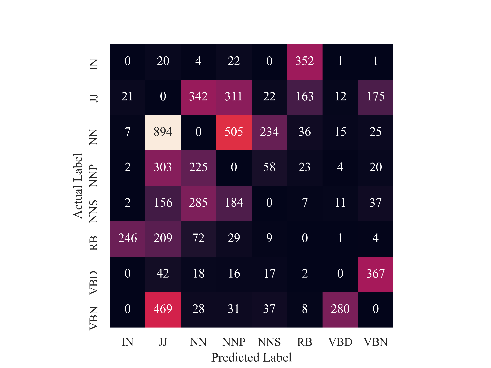

# POS tagging with Hidden Markov model

This repo contains the implementation for a trigram part-of-speech (POS) tagger.

### Installation

- This code was tested with Anaconda v4.10.1, Python v3.8.11. 

### Data Preparation

- Download the train dataset, development dataset, and test dataset from [here](https://cis.upenn.edu/~myatskar/teaching/cis530_fa21/hmm/data.zip)
- Put correspondin dataset in the ***data*** folder under the folder containing `pos_tagger.py`

### Run POS tagging

- The best test result can be reproduced by running

  ```
  python pos_tagger.py --dev --inference_type viterbi --Ngram 3 --rare --rare_thr 2 --smooth_type addk --addk_param 0.001 --sep_doc --save_dev --test
  ```

  - The execution time is about 130 seconds for development dataset.
  - This should create a folder named , containing a txt file recording used arguments and hyper-parameters, a `pred_dev_y.csv` file as tagged sequence for the development dataset, and a `test_y.csv` file as the result on the test dataset.

- The full setting of arguments and hyper-parameters for this tagger is as follows

  ```
  	-h, --help           	show this help message and exit
    --Ngram NGRAM         could be 2, 3, 4 for bi-, tri-, 4-gram
    --smooth_type SMOOTH_TYPE
                          None, addk, or interpolation
    --addk_param ADDK_PARAM
                          the value of k for add-k smoothing
    --inference_type INFERENCE_TYPE
                          choose among [greedy, beam, viterbi]
    --beam_k BEAM_K       value of k for Compute scores of k-best states, 														choose among [2, 3]
    --save_dev            whether to save the result on the dev dataset
    --dev                 whether to evaluate tagger on the dev dataset
    --test                whether to test
    --sep_sentence        if True, split input dataset by sentence(.) and tag
                          each sentence separately
    --sep_doc             if True, tag each document separately
    --rare                if True, replace infrequent words
    --rare_thr RARE_THR   mark word in the training set as rare if it appears
                          less or equal to rare_thr
    --unk_suffix          deduct tag of rare words using prefix and suffix
  ```

### Results

| inference type  | Viterbi | Viterbi               | Viterbi | Viterbi | Viterbi | Beam(2) | Beam(3) | Greedy  |
| --------------- | ------- | --------------------- | ------- | ------- | ------- | ------- | ------- | ------- |
| n-gram          | trigram | trigram               | trigram | bigram  | 4-gram  | trigram | trigram | trigram |
| smoothing       | add-k   | Inter-polation        | None    | add-k   | add-k   | add-k   | add-k   | add-k   |
| smoothing value | 0.001   | {[}0.48,0.40, 0.12{]} | -       | 0.001   | 0.001   | 0.001   | 0.001   | 0.001   |
| split doc       | True    | True                  | True    | True    | True    | True    | True    | True    |
| rare thr        | 2       | 2                     | 2       | 2       | 2       | 2       | 2       | 2       |
| Unknown word F1 | 0.7104  | 0.7132                | 0.7078  | 0.6798  | 0.6730  | 0.6880  | 0.7053  | 0.6225  |
| **Overall F1**  | 0.9511  | 0.9508                | 0.9504  | 0.9479  | 0.9293  | 0.9480  | 0.9500  | 0.9299  |

### Evaluate

- Run the following script to print F1 score (`$FOLDER NAME`=`test_reusult`)

  ```
  python evaluate.py
  --predicted <FOLDER NAME>/pred_dev_y.csv
  --development data/dev_y.csv
  ```

- Run the following script to print confusion matrix and its visualization

  ```
  python evaluate.py
  --predicted <FOLDER NAME>/pred_dev_y.csv
  --development data/dev_y.csv
  --confusion
  ```

  - The heatmap (require seaborn package) of the most common confusions is

  


